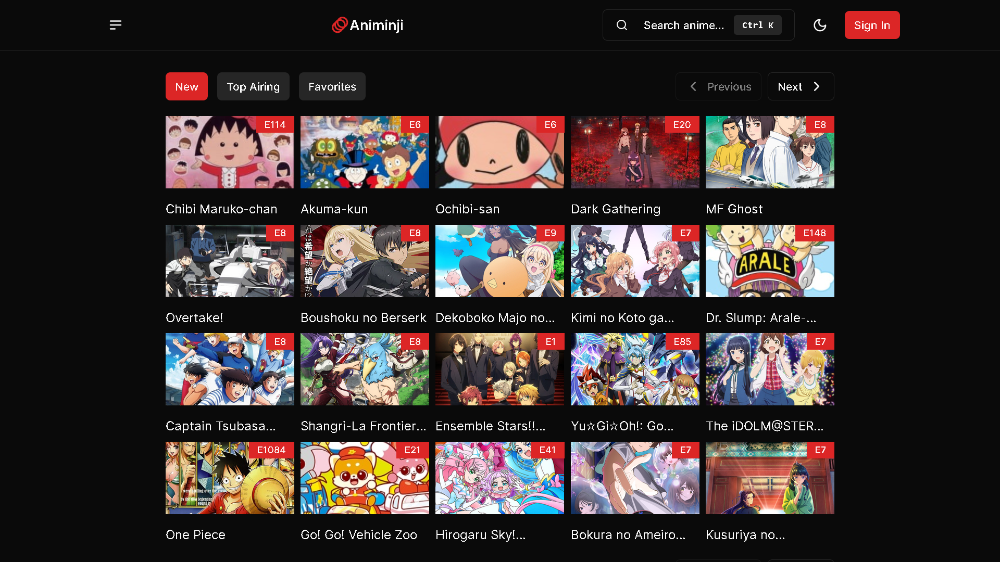
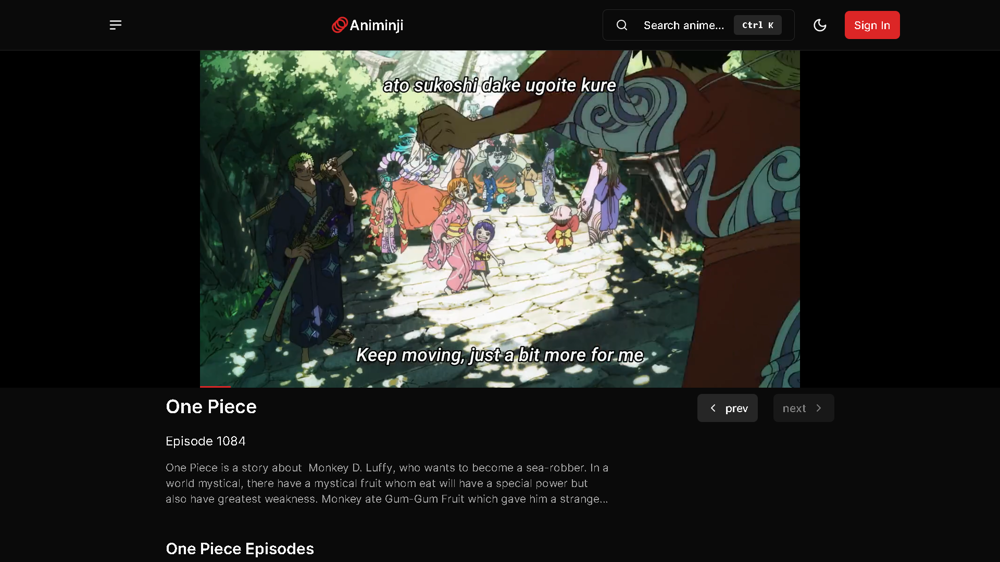

# Animinji - Anime Streaming Website

Fullstack anime streaming platform where you can watch & stream anime.


# Table of Contents

- [Overview](#overview)
- [Features](#features)
- [Installation](#installation)


## Overview




### Built With

- [Next.js 13](https://nextjs.org/docs): A popular React framework for building web applications.
- [Shadcn](https://ui.shadcn.com/): A library for enhancing UI design.
- [Tailwind CSS](https://tailwindcss.com/): A utility-first CSS framework for rapidly building custom designs.
- [Supabase](https://supabase.com/): An open-source Firebase alternative for building serverless, real-time applications.
- [TanStack Query](https://tanstack.com/query/latest): A data-fetching library for React.
- [trpc](https://trpc.io/): A modern TypeScript utility for building type-safe APIs.
- [Clerk](https://clerk.com/): A solution for authentication and user management.
- [ArtPlayer](https://www.artplayer.org/document/): A customizable video player for your web application.
- [Sonner](https://sonner.emilkowal.ski/): A library for creating toasts in your web app.


## Features

Animinji allows users to watch anime, add favorites and leave comments for an engaging anime experience.

## Installation

Clone and add your own env files

```bash
# Example installation commands
git clone https://github.com/yourusername/your-project.git
cd your-project
npm install
```

# How to use the example environment file

1. Copy the `.env.example` file.
2. Rename the copied file to `.env`.
3. Replace the placeholder values with your actual configuration values.

Now your application can read configurations from the `.env` file.


